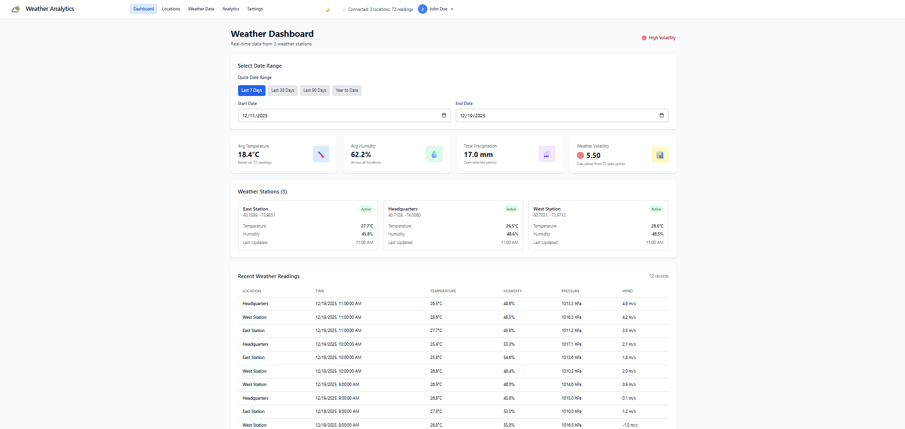
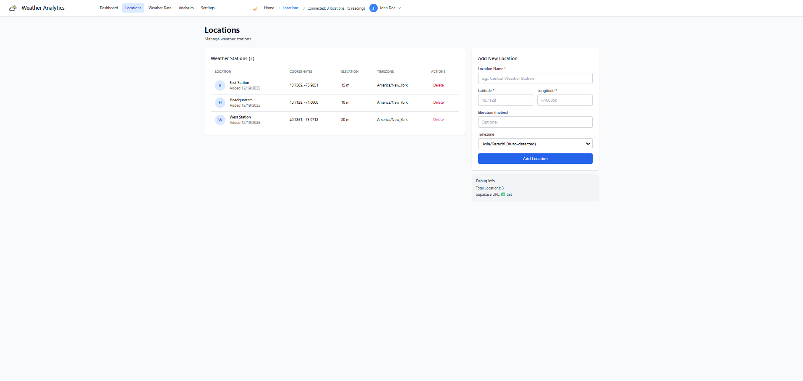
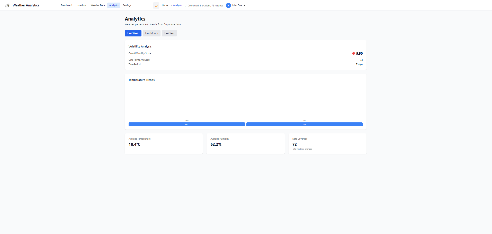

# 🌤️ Weather Analytics Dashboard


A professional weather monitoring dashboard with real-time data visualization, volatility analysis, and secure backend powered by Supabase.

## ✨ Live Demo
[🔗 Live Demo Link](https://supabase-weather-dashboard.vercel.app/)

## 🎯 Features

### 📊 **Core Features**
- **Real-time Weather Monitoring**: Track temperature, humidity, pressure, wind speed, and precipitation
- **Weather Volatility Analysis**: Calculate and visualize weather stability with intelligent indicators
- **Multi-location Support**: Manage and monitor multiple weather stations
- **Data Visualization**: Interactive charts and metrics dashboard
- **Date Range Filtering**: Smart defaults with "Last 7 days" auto-selection

### 🛠️ **Technical Features**
- **Type-Safe Development**: Full TypeScript integration with auto-generated Supabase types
- **Responsive Design**: Mobile-first approach with TailwindCSS
- **Dark/Light Mode**: System preference detection with manual override
- **Row Level Security**: Secure data access with Supabase RLS policies
- **Modular Architecture**: Reusable components with clean separation of concerns

### 🔒 **Security & Performance**
- **JWT Authentication**: Secure user sessions with Supabase Auth
- **Data Validation**: Comprehensive input validation and error handling
- **Optimized Queries**: Efficient database queries with proper indexing
- **Error Boundaries**: Graceful error handling and user feedback

## 📸 Screenshots

| Dashboard | Locations Management | Analytics |
|-----------|---------------------|-----------|
|  |  |  |

## 🏗️ Architecture

### Tech Stack
```
Frontend:
├── React.js 18.2.0
├── TypeScript 5.2.2
├── Vite 5.0.0
├── TailwindCSS 3.3.5
└── React Router DOM 6.20.0

Backend:
├── Supabase (PostgreSQL)
├── Row Level Security
├── Real-time Subscriptions
└── Storage & Authentication

Development:
├── ESLint
├── Prettier
└── TypeScript strict mode
```

### Project Structure
```
src/
├── components/           # Reusable UI components
│   ├── Header_Nav/      # Responsive navigation
│   ├── VolatilityIndicator/  # Weather stability indicators
│   ├── DateRangePicker/ # Smart date selection
│   └── ui/              # Base UI components
├── pages/               # Application pages
│   ├── Dashboard.tsx    # Main dashboard
│   ├── Locations.tsx    # Station management
│   ├── WeatherData.tsx  # Data exploration
│   ├── Analytics.tsx    # Trends & insights
│   └── Settings.tsx     # User preferences
├── types/                 # Utilities & configurations
│   ├── supabase.ts      # Supabase client
│   └── database.types.ts # Auto-generated types

```

## 🚀 Getting Started

### Prerequisites
- Node.js 18+ 
- Supabase account
- Git

### Installation

1. **Clone the repository**
   ```bash
   git clone https://github.com/yourusername/weather-analytics-dashboard.git
   cd weather-analytics-dashboard
   ```

2. **Install dependencies**
   ```bash
   npm install
   ```

3. **Set up environment variables**
   ```bash
   cp .env.example .env
   ```
   Edit `.env` with your Supabase credentials:
   ```env
   VITE_SUPABASE_URL=your_project_url
   VITE_SUPABASE_ANON_KEY=your_anon_key
   ```

4. **Set up database schema**
   - Navigate to your Supabase project SQL editor
   - Run the SQL from `schema.sql` to create tables and RLS policies

5. **Seed sample data**
   ```bash
   npm run populate-data
   ```

6. **Start development server**
   ```bash
   npm run dev
   ```

7. **Open your browser**
   ```
   http://localhost:5173
   ```

## 📊 Database Schema

### Tables Design
```sql
-- Locations table
CREATE TABLE locations (
    id UUID PRIMARY KEY DEFAULT uuid_generate_v4(),
    name VARCHAR(255) NOT NULL,
    latitude DECIMAL(10,8) NOT NULL,
    longitude DECIMAL(11,8) NOT NULL,
    elevation INTEGER,
    timezone VARCHAR(50),
    created_at TIMESTAMP WITH TIME ZONE DEFAULT NOW(),
    updated_at TIMESTAMP WITH TIME ZONE DEFAULT NOW()
);

-- Weather readings with foreign key
CREATE TABLE weather_readings (
    id UUID PRIMARY KEY DEFAULT uuid_generate_v4(),
    location_id UUID REFERENCES locations(id) ON DELETE CASCADE,
    recorded_at TIMESTAMP WITH TIME ZONE NOT NULL,
    temperature_c DECIMAL(5,2),
    humidity_percent DECIMAL(5,2),
    pressure_hpa DECIMAL(7,2),
    wind_speed_ms DECIMAL(5,2),
    wind_direction_deg INTEGER,
    precipitation_mm DECIMAL(6,2),
    created_at TIMESTAMP WITH TIME ZONE DEFAULT NOW(),
    CONSTRAINT unique_location_time UNIQUE(location_id, recorded_at)
);
```

### Row Level Security Policies
Implemented comprehensive RLS policies ensuring:
- Public read access for weather data
- Authenticated users can insert new readings
- Location management restricted to authenticated users
- Secure data access patterns

## 🔧 Key Implementation Details

### 1. **Type-Safe Supabase Integration**
```typescript
// Auto-generated types from Supabase schema
import { createClient } from '@supabase/supabase-js';
import { Database } from './database.types.ts';

// Fully typed client
export const supabase = createClient<Database>(
  import.meta.env.VITE_SUPABASE_URL,
  import.meta.env.VITE_SUPABASE_ANON_KEY
);
```

### 2. **Weather Volatility Calculation**
```typescript
export const calculateWeatherVolatility = (metrics: {
  temperature?: number[];
  humidity?: number[];
  pressure?: number[];
  windSpeed?: number[];
}): number => {
  // Weighted standard deviation calculation
  const weights = { temperature: 0.4, humidity: 0.2, pressure: 0.2, windSpeed: 0.2 };
  // Returns volatility score (0-10 scale)
};
```

### 3. **Responsive Navigation Component**
- Mobile-first design with hamburger menu
- Dynamic breadcrumbs based on route
- Dark mode toggle with system preference detection
- Supabase connection status indicator

### 4. **Smart Date Range Picker**
- Defaults to "Last 7 days" automatically
- Quick presets (7, 30, 90 days, YTD)
- Custom range selection
- Type-safe date handling

## 🧪 Testing

### Run Tests
```bash
# Unit tests
npm test

# Type checking
npx tsc --noEmit

# Linting
npm run lint
```

### Test Coverage
- Component unit tests with React Testing Library
- TypeScript strict mode enabled
- ESLint with React/TypeScript plugins
- Prettier for code formatting

## 📈 Performance Optimizations

### Frontend
- **Code Splitting**: Route-based lazy loading
- **Image Optimization**: WebP format with lazy loading
- **Bundle Analysis**: Vite build optimization
- **Memoization**: React.memo and useCallback for expensive computations

### Database
- **Indexed Columns**: Performance-optimized queries
- **Connection Pooling**: Efficient Supabase client usage
- **Query Optimization**: Limited selects with proper filtering

## 🔒 Security Implementation

### Authentication
- JWT-based authentication with Supabase Auth
- Secure session management
- Protected routes

### Data Protection
- Row Level Security policies
- Input validation and sanitization
- HTTPS enforcement
- Environment variable protection

### API Security
- Rate limiting (via Supabase)
- CORS configuration
- Query parameter validation

## 🌐 Deployment

### Vercel Deployment
```bash
# Install Vercel CLI
npm i -g vercel

# Deploy
vercel
```

### Environment Variables
Required environment variables for deployment:
- `VITE_SUPABASE_URL`
- `VITE_SUPABASE_ANON_KEY`

## 🤝 Contributing

1. Fork the repository
2. Create a feature branch (`git checkout -b feature/AmazingFeature`)
3. Commit changes (`git commit -m 'Add AmazingFeature'`)
4. Push to branch (`git push origin feature/AmazingFeature`)
5. Open a Pull Request

### Development Guidelines
- Follow TypeScript strict mode
- Write comprehensive component documentation
- Include appropriate test coverage
- Update README.md for new features

## 📚 Learning Resources

### Concepts Demonstrated
- **React.js**: Hooks, Context, Custom Hooks, Component Composition
- **TypeScript**: Generics, Utility Types, Type Guards, Strict Configuration
- **Supabase**: RLS, Real-time, Authentication, Type Generation
- **TailwindCSS**: Responsive Design, Dark Mode, Component Styling
- **State Management**: React State, Context API, URL State

### Advanced Patterns
- Compound Components
- Render Props
- Custom Hooks for data fetching
- Error Boundary implementation
- Suspense and lazy loading

## 🏆 Acknowledgments

- **Supabase** for the amazing backend-as-a-service platform
- **Vite** for the fast build tooling
- **TailwindCSS** for the utility-first CSS framework
- **React Community** for excellent libraries and patterns

## 📄 License

This project is licensed under the MIT License - see the [LICENSE](LICENSE) file for details.

---

⭐ **Star this repo if you found it helpful!**
